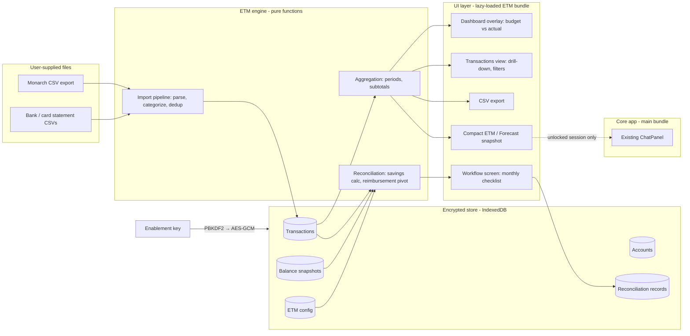

# Expense Tracking Module (ETM) — Systems Architecture & Implementation Plan

Status: **in progress** — Phases 1–4 (§10) are built; Phase 5 (vault JSON
backup) and Phase 6 (Ask a question + ETM snapshot) are still proposed.
They are independent: do not fold Phase 6 into Phase 5.

Inputs: `docs/ExpenseTrackingModuleSpecs.md`, `docs/Workflow.md` (both private,
gitignored), `docs/product-spec.md`, `docs/category-mapping.md`, and the sample
data in `planning-data/` (gitignored).

This document is deliberately sanitized: account numbers, balances, float
amounts, tag names, and household-specific workflow details never appear in
code or committed docs. Everything personal is **user data or user
configuration**, entered at runtime and stored encrypted on the device.

## Notes for the implementing agent

- **When this document or the specs are ambiguous, stop and ask the user
  before choosing.** Do not silently pick an interpretation for anything
  touching security, the data model, dedup/identity, or the reconciliation
  math. Small UI judgment calls are yours to make.
- These decisions are already settled with the user — do not revisit them:
  the key derives real encryption (not a feature flag); Monarch is the
  transaction source of record; bank/card statement CSVs supply balances
  only, never transactions; USD is tracked natively with no conversion;
  **Ask a question**, when ETM is unlocked, may receive a compact derived
  snapshot of ETM/Forecast totals — never the ledger, never a second
  passphrase, and never by importing the forecast engine into the main
  bundle (§5.1). That work is **not** ETM Phase 5 (vault JSON backup).
- Never commit, log, or embed anything from `planning-data/`,
  `docs/Workflow.md`, or `docs/ExpenseTrackingModuleSpecs.md` (all
  gitignored). Tests use synthetic fixtures only.
- Implement the phases in §10 in order; verify each phase's exit criteria
  before starting the next. Phase 1's "app unchanged without a key"
  criterion is load-bearing for everything after it. Phase 6 does not
  depend on Phase 5: do not wait for backup to start it, and do not
  merge the two.

---

## 1. Design principles (inherited and new)

From the Tidewater product spec, unchanged:

1. **Local-first, always.** All ETM data lives in the browser (IndexedDB).
   No server, no analytics, no cloud storage of personal data.
2. **Open-source only.** New capabilities use the browser's built-in Web
   Crypto API and the existing dependency set (React, PapaParse, idb).
   No new proprietary dependencies.
3. **Calm, non-judgmental UX.** Actual-vs-budget views inform; they never
   scold. Desktop/tablet landscape remains the target form factor.

New, from the ETM spec:

4. **Truly optional.** With the module disabled, Tidewater behaves exactly
   as it does today — same UI, same flows, and the ETM code is not even
   loaded (lazy, code-split bundle).
5. **The key is real protection, not a switch.** All ETM data is encrypted
   at rest with a key derived from the enablement key. Without the key the
   data is unreadable; a curious person with device access or a copy of the
   source code learns nothing.
6. **No bank or Monarch credentials, ever.** There is no API integration.
   All data arrives by manual CSV import or manual entry, so no credential
   can leak because none is ever held.
7. **Nothing personal in the repo.** Fixtures used for tests are synthetic.
   Real statements, workflow docs, and reconciliation sheets stay gitignored.

## 2. System overview

Three layers, mirroring the existing app's structure:

- **Engine** (`src/lib/etm/`): pure, testable functions — parsing,
  categorization, period math, aggregation, reconciliation. No DOM, no
  storage. Reuses `src/lib/categories.ts` verbatim so ETM categorization
  follows the exact philosophy documented in `docs/category-mapping.md`.
- **Store** (`src/lib/etm/storage`): a dedicated IndexedDB database,
  separate from the existing budget store, holding only AES-GCM ciphertext.
- **UI** (`src/components/etm/`): a code-split bundle mounted only after a
  successful unlock.

**Ask a question** stays in the core app (`ChatPanel` in the main bundle).
When ETM is unlocked, the lazy chunk may hand it a compact snapshot of
totals and classifications already computed for the dashboard overlay and
Forecast — optional extra context, not a new server, not a second chat,
and not an import of `src/lib/forecast/` into `App.tsx`. Locked, or with
no ETM, chat is unchanged: typical-month Budget only. See §5.1.

## 3. Module gating and key security

### Enablement flow

- A quiet entry point lives in the existing **Your data** menu:
  *"Enable expense tracking…"*. Nothing else in the app changes while the
  module is disabled — this satisfies the "operates exactly as it does now"
  acceptance criterion.
- The owner chooses the key and shares it privately with trusted users.
  There is no server, so there is no central key registry: the **first**
  entry of the key on a device initializes that device's encrypted ETM
  store; later sessions must present the same key to unlock it. Each
  device's ETM data is whatever was imported on that device (local-first).
- **Disable** locks the module (discards the in-memory key). A separate,
  clearly-worded action wipes the encrypted store entirely.

### Cryptography (Web Crypto API — built into the browser, no dependency)

| Concern | Choice |
| --- | --- |
| Key derivation | PBKDF2-SHA-256, ≥ 600 000 iterations, per-device random salt |
| Data encryption | AES-GCM 256, random 96-bit IV per record |
| Key verification | A fixed sentinel encrypted at setup; unlock succeeds only if it decrypts |
| Key at rest | Not stored by default (session unlock). Optional per-device "stay unlocked" stores the derived key as a **non-extractable** CryptoKey in IndexedDB |
| Key loss | Data is unrecoverable by design — and acceptably so, because everything is reproducible from Monarch re-exports |

What plaintext ever exists: only in page memory while unlocked. IndexedDB
holds ciphertext, the salt, and the sentinel. Exports/backups of ETM data
are written as ciphertext too (§8).

### Bundle isolation

The ETM UI and engine are loaded with a dynamic import triggered only after
unlock. Users without the key download and execute the same app they do
today, keeping the "no change for other users" promise literal.

### Distribution builds without the module (implemented)

The module may become a paid feature, so a build flavor exists that ships
with **no trace of ETM at all** — not a hidden button, an absent one:

- `npm run build` (and the existing Vercel deploy) includes the module,
  exactly as before.
- `npm run build:public` (Vite `--mode public`) sets the compile-time
  constant `__ETM_AVAILABLE__` to `false` (see `vite.config.ts`). The
  enablement row, the presence probe, its storage key, and the entire
  lazy-loaded ETM chunk are dead-code-eliminated — the public bundle
  contains no ETM code, strings, or storage keys, verified by grep.
- `npm run dev:public` runs the dev server in the same flavor.

Implementers: every new ETM touchpoint in the main bundle (entry points,
probes, presence hints) must sit behind a compile-time
`__ETM_AVAILABLE__` check so the public flavor stays clean. Re-verify with
a public build before releases.

## 4. Data architecture

A new IndexedDB database (`tidewater-etm`), independent of the existing
`tidewater.budget` key, so the budget feature can never be destabilized by
ETM migrations. Records are encrypted per month-chunk (transactions) or per
record (everything else), keeping writes small at this data scale
(a few thousand transactions per year).

### Entities

**Account** — a registry the user builds, since account meaning is personal:

| Field | Notes |
| --- | --- |
| id, nickname | e.g. "Everyday spending" — user's words |
| kind | chequing / savings / credit card |
| currency | CAD or USD; **no conversion is ever applied** (§7) |
| lastFour | display only; full numbers are never entered or stored |
| monarchName | the account string as it appears in Monarch exports, for matching |
| role flags | *funding account* (pays for everything), *savings destination*, *excluded from family budget* (e.g. a personal card tracked only for reimbursement) |
| float | optional minimum balance kept in the account (used by the savings formula) |

**Transaction** — one row per Monarch export line or manual entry:

| Field | Notes |
| --- | --- |
| id | stable content hash of (date, account, amount, original statement) plus an occurrence index, so identical rows in one file stay distinct |
| date, merchant, originalStatement, notes | from Monarch |
| amount, currency | signed; negative = spend. Currency comes from the account |
| category | the Monarch subcategory name, kept verbatim (Tidewater never renames) |
| groupId | derived via `groupForCategory` — the existing ten-group mapping |
| internal | true for transfers / card payments / balance adjustments, per the existing skip-list; internal rows are excluded from income & spend totals but remain visible in account and reconciliation views |
| tags, owner, reviewed | from Monarch; tags drive the reimbursement pivot |
| source | monarch / manual (manual covers cash spending) |
| importBatchId | for undo and provenance |

**BalanceSnapshot** — accountId, date, balance, pending charges, source
(manual entry or parsed from a bank statement CSV). These are the
reconciliation anchors.

**ImportBatch** — date range, row counts, duplicates skipped, imported-at.
Lets the user review and undo an import.

**ReconciliationRecord** — one per month: the inputs used (balances,
pending amounts), the computed savings figure, the reimbursement pivot
snapshot, transfers the user recorded, the residual delta, status
(open / reconciled), and notes.

**EtmConfig** — the user's workflow, expressed as configuration rather than
code: which tag marks a transaction reimbursable, the list of reimbursement
buckets (tag → bucket → who owes), which account is the funding account,
the float amount, the savings destination, and the reconciliation tolerance
(default: a few dollars).

### Import pipeline and dedup

Monarch is the **source of record** for transactions, categories, tags, and
splits (splits arrive from Monarch as separate rows, so no split feature is
needed in ETM).

1. Parse with PapaParse (already a dependency); validate the header shape.
2. Match each row's account string to the registry; offer to create
   unrecognized accounts during import review.
3. Compute the stable id. Existing ids are **upserted** — a re-export after
   the user re-categorized or re-tagged in Monarch updates those fields
   here, which matches the daily-review workflow. Manual transactions are
   never touched by imports.
4. Derive groupId and the internal flag using the existing rules.
5. Show an import review (mirroring the current `ImportProgress` pattern):
   new rows, updated rows, skipped duplicates, unmatched accounts.

Bank/card statement CSVs (headerless: date, description, debit, credit,
running balance; bank dates ISO, card dates MM/DD/YYYY) are parsed **only**
to capture balance snapshots — the closing running balance per account —
not as a second transaction source. This avoids a fragile matching/dedup
layer while giving reconciliation its balance anchors. Balances can always
be typed in manually instead (pending card charges must be, since no export
contains them).

## 5. Aggregation and views (implemented)

A single **period selector** (month / year-to-date / custom range) drives
every ETM view. All aggregation is pure: `(transactions, period, filters) →
totals`, computed in memory (thousands of rows — no indexing infrastructure
needed). Dates are compared as ISO strings end to end; parsing them into
`Date` objects invites a timezone to move a transaction into the
neighbouring month.

Five rules settle what the numbers mean, and every view obeys them:

- **A monthly plan over a longer period** is multiplied by the calendar
  months the period touches. A year-to-date period part-way through August
  compares against eight months of plan — a figure someone recognises from
  their own budget, unlike a day-weighted fraction.
- **Plan lines and Monarch categories** are independent free text, so they
  are paired on their names ignoring case and spacing. Whatever fails to
  pair still appears: planned but unspent on one side, spent but unplanned
  on the other. A comparison that hides a difference is worse than none.
  (Hand-linking a plan line to a differently worded category is a possible
  later addition; nothing here depends on it.)
- **Currencies are never converted or added** (§7). A USD figure rides
  beside the CAD one everywhere — bars, ring, group and category rows,
  transaction totals — and is never folded in.
- **Categories are netted before being classified**, so a refund lands back
  on the category it came from rather than reading as income. This is the
  treatment the budget importer already gives them.
- **Reimbursable transactions are not family-budget spending** (decided
  with the owner, Aug 2026). A transaction in the reimbursable family
  (configurable prefix, default "Reimbursable") is an advance repaid at
  month end: either that tag itself or any `Reimbursable: …` sub-tag. The
  generic parent is not required once a specific sub-tag is present. The
  repayment arrives as an internal transfer, so counting the purchase
  would overstate spending with no offsetting inflow. Reimbursables are
  excluded from budget-vs-actual everywhere (bars, ring, drill-ins) and
  counted instead in a per-bucket "Reimbursable" section of the Expenses
  area (bucket = the name after the colon, plus any other tags), which is
  also the input to the reimbursement pivot. They stay fully visible, with a
  marker, in the Transactions view and exports, and the tie-out holds:
  total out = budget spending + reimbursable spending. They are counted on
  **every** account, including one flagged as kept out of the family budget:
  that flag suppresses budget spending only, since such an account is usually
  a personal card tracked precisely so its advances can be claimed back.

Two details the reimbursable rule left open, settled with the owner in
building it. A bucket is only obvious when there is exactly one other tag, so
**a row with none falls into a visible "No bucket", and a row with several is
counted once under all of them together** ("Healthcare + Chris Personal")
rather than once per tag. Counting it under each would read more naturally
per bucket but would make the subtotals exceed the total and break the
tie-out, and a bucket that quietly picked one tag would hide the choice. And
because reimbursables leave budget-vs-actual, the dashboard's "Out" and "Went
out" are **budget spending only**, matching the bars and ring beside them;
where an amount has been held out, the figure says so in words and points at
the Expenses area for the full tie-out.

### Dashboard integration (budget vs actual)

The existing dashboard remains the core view. With ETM unlocked it gains a
calm overlay: each group bar shows planned vs actual for the selected
period ("planned X, spent Y"), and the summary ring gains a second, thinner
ring inside it reading the same way but from what actually happened. Tone
stays observational — abundance, not alarm.

The module hands the dashboard **finished numbers only** (`DashboardActuals`
— totals and a group→amount map). `GroupBars`, `SummaryRing` and `App` take
them as an optional prop typed through a type-only import, and each folds
its comparison markup behind `__ETM_AVAILABLE__` so the public flavour
drops it entirely (§3). No ETM value or string is reachable from the main
bundle.

Decrypted rows are loaded once, by `useEtmData`, and shared by the
dashboard strip and the full expenses area. The strip appears only after
the module has been opened in a session; a remembered unlock still costs
one click, and the ETM chunk is never fetched on a plain page load.

### Drill-down

Group → subcategory → transactions, extending the existing `GroupDetail`
pattern:

- Tapping a group shows its subcategories with budget, actual, and the
  difference, each with a subtotal.
- Tapping a subcategory reveals the underlying transactions for the period,
  with a running subtotal — the "view the underlying transactions with
  subtotals" acceptance criterion.

### Reimbursable section

Its own tab beside Budget, and the only place reimbursables are counted:
per-bucket subtotals for the period, each opening onto the transactions
behind it, above the tie-out that proves nothing was lost between the two
halves. The tag it looks for is the first field of `EtmConfig` to become
editable, so a workflow that calls it something else is a setting rather
than a fork. Phase 4's reimbursement pivot reads these buckets.

### Transactions view

A full filterable table: period, account, group, category, tags, owner,
amount range, and text search across merchant/statement/notes. Totals and
subtotals follow the active filters. USD accounts display in USD, visually
separated, never mixed into CAD totals. Reimbursables are here like anything
else, marked but never filtered out: this view is the whole record, and the
one place to confirm what the budget set aside.

### 5.1 Ask a question and ETM (proposed, not built)

This is **not** the month-end checklist in §6. **Ask a question** is the
product-spec chat: a floating panel in the main bundle that answers from
the typical-month Budget. This subsection records how that panel may, once
expense tracking is unlocked, also see ETM and Forecast *patterns* — still
without ever seeing the ledger.

Forecast is already shipped. This work is a **later phase** (§10 Phase 6).
It is **not** Phase 5 (encrypted vault JSON backup). Do not fold them
together, and do not wait for backup to start this.

#### Why this exists

Today `src/lib/assistant.ts` builds `budgetSummaryText(budget)` — income,
planned spend by group, goals — and both local regex intents and optional
cloud (the user’s OpenAI or Anthropic key, after acknowledgement) answer
from that plan alone. `ChatPanel` is imported from `src/App.tsx`. Help
currently overclaims that chat can “analyze spending patterns.” It cannot:
it has never seen actuals or Forecast. The intended fix is a compact
snapshot of numbers ETM and Forecast already compute, not a dump of
transactions.

#### Settled design — do not reopen

- **Optional and vault-gated.** Locked, or no ETM at all → chat stays
  plan-only, identical to today. Unlocked → chat *may* receive an extra
  compact snapshot. The public build (`__ETM_AVAILABLE__` false) must stay
  free of ETM and Forecast in the main bundle.
- **Derived snapshot, never the ledger.** Do not send or prompt with raw
  transactions, merchants, accounts, or the full CSV. The snapshot is
  totals and classifications ETM/Forecast already compute, for the **active
  window** (12 / 24 / all-time) and **current as-of**, at
  **category-and-month grain**. It is not “why was 12 March high.”
- **Bundle boundary (load-bearing).** `scripts/check-forecast.ts` asserts
  `App.tsx` does not import `lib/forecast` or `ForecastPanel`. Keep that.
  Snapshot construction lives in the lazy ETM chunk. `ChatPanel` /
  `answer()` may take an optional `etmContext?: string` (or a small DTO
  serialized to text) passed from `App` only as data **already produced
  behind the unlock gate** — the same “finished numbers only” pattern as
  `DashboardActuals`. The main graph must not import the forecast engine
  to build that string.
- **Local vs cloud.** Local: new intents that distinguish plan vs
  actual/forecast (“what did I spend” vs “what is the typical-month
  plan”). Cloud: the same compact snapshot appended to the system
  context, not thousands of rows. Update the Settings acknowledgement:
  a **spending/forecast summary** leaves the device, not the vault. Keys
  stay on device.
- **Voice.** Same Tidewater assistant prompt: calm, no shame, use only
  the numbers given, CAD unless stated.
- **Reimbursable semantics — do not blur.** ETM Budget-tab actuals still
  hold out the **whole reimbursable family**. Forecast’s household
  allow-list is a **different split** (allow-listed sub-tags count as
  household; vacation is its own series; everything else is excluded —
  `docs/forecasting-architecture.md` §3 and §5). The snapshot **must name
  which series a figure came from** so chat does not treat Budget-tab
  actuals and Forecast household as the same number.

#### Snapshot contents

Include, as compact labelled lines (or an equivalent small DTO then
serialized), for example:

| Figure | Grain / notes |
| --- | --- |
| Plan vs actual by group and category | Dashboard overlay grain; Budget-tab actuals (reimbursable family held out) |
| Forecast per category | Type (monthly / seasonal / annual / irregular), likely, typical months, low-sample |
| Current month | Actual to date, remain / remain lines, overlay monthly + overlay lines. Overlay is the irregular smear, **not** in the Forecast column — overlay vs calendar vs plan is defined in `docs/forecasting-architecture.md` §7 |
| Household vs vacation | Same allow-list / vacation tags as Forecast; name the series on every total |
| Recommended set-aside vs typical-month plan | Forecast’s likely set-aside beside the core Budget plan; chat does not rewrite either |

Name the window and as-of on the snapshot the way Forecast already names
them on the tab. Currencies stay unconverted: CAD and USD as separate
figures, never added.

#### Principles (unchanged)

**Local-first, always.** The vault, the ledger, and Forecast config never
leave the device. Chat does not open a Tidewater server.

**Cloud remains opt-in summary only.** A user who has not entered a key
and ticked the acknowledgement gets local answers on-device. When they
have, what may leave is the existing plan summary **plus** this compact
snapshot — still not transactions, merchants, accounts, or ciphertext.
The acknowledgement copy must say so.

#### In scope / out of scope

| In | Out |
| --- | --- |
| Compact derived snapshot (totals and classifications already computed) | Raw transaction dump, merchant Q&A, “why was this row high” |
| Local intents that distinguish typical-month plan vs actual / forecast | Chat rewriting the Budget or Forecast (no apply-to-plan, no placing known futures from chat) |
| The same snapshot appended to optional cloud system context | A second Forecast UI inside the chat panel |
| Settings acknowledgement: spending/forecast summary leaves the device, not the vault; keys stay on device | A second passphrase, a second vault, or any server of Tidewater’s |
| Help copy that stops overclaiming “analyze spending patterns,” and that names ETM/Forecast only behind `__ETM_AVAILABLE__` | Implementing Phase 5 (filtered CSV export, encrypted ETM section in the JSON backup) |

#### Implementation notes for a later agent

Proposed, not built. Do not start this as a side quest of Phase 5.

Likely files:

- `src/lib/assistant.ts` — optional context on `localAnswer` / `cloudAnswer` /
  `answer()`; new local intents; existing `SYSTEM_PROMPT` voice unchanged.
- `src/components/ChatPanel.tsx` — optional `etmContext` (or serialized DTO);
  acknowledgement copy.
- A **new helper** inside `src/components/etm/` or `src/lib/forecast/` that
  **only the ETM module calls**. It reads numbers the overlay and Forecast
  engine already have. It must not be imported from `App.tsx`.
- `src/App.tsx` — plumb an optional string (or finished DTO) from the
  unlocked ETM tree into `ChatPanel`, the way `actuals={etmActuals}` already
  works. Do not add `lib/forecast` or `ForecastPanel` imports; `check:forecast`
  will fail if you do.
- `src/components/HelpModal.tsx` — fix the overclaim when this phase ships;
  gate any ETM/Forecast wording with `__ETM_AVAILABLE__`.
- `scripts/check-assistant.ts` — synthetic fixtures only (Ted’s sample budget
  plus invented ETM/Forecast snapshot text). Never personal CSVs.

Gates: `npm run typecheck`, `npm run check:etm`, `npm run check:forecast`
(bundle isolation), `npm run check:assistant`.

#### Help / copy (current vs intended)

**Current (overclaim):** Help’s assistant summary says chat can “analyze
spending patterns.” The panel body describes a local assistant that answers
“about your spending” from on-device numbers. Those numbers are the
typical-month **plan**. Settings still say “a summary of your budget”
leaves the device.

**When Phase 6 is implemented:** say what is actually true — plan always;
actuals and forecast patterns only while expense tracking is unlocked;
cloud still a compact summary, not the vault. Until then, do not implement
the copy fix as a silent drive-by; it belongs with the snapshot.

## 6. Workflow screen (reconciliation assistant)

A new screen presenting the monthly cycle as a gentle checklist. Every
number it produces is explained on screen, because the goal is assisting a
human workflow, not replacing judgment.

The order below is the owner's actual cycle (confirmed Aug 2026) and is not
arbitrary: the claims go out *before* the month ends so the repayments land
inside it, while the balances can only be recorded once it has.

1. **Tidy** — load the latest Monarch export, then surface uncategorized
   transactions, leftover generic parent tags (no `Reimbursable: …` sub-tag),
   and untagged candidates for the reimbursable family. This comes first
   because the next step is only as good as the tags under it. An account
   qualifies as a candidate source only once it has actually carried a family
   tag: being kept out of the family budget does not on its own mean claims
   happen there (a separate business account is out of the budget too), and
   asking about every one of its expenses would be noise forever.
2. **Reimbursements** — the pivot the user currently builds by hand in a
   spreadsheet: all transactions in the reimbursable family, grouped by
   derived bucket, subtotaled per currency, and expressed as an amount to
   ask a named person for. Done a business day or so before month end.
   Recorded transfers are noted on the reconciliation record.
3. **Closing balances** — what each account closed the month at, from a
   statement CSV or typed in. Card balances are entered as what is owed,
   plus any charges that have not posted yet.
4. **Monthly savings** — computes: funding-account balance − float − main
   card balance − main card pending charges, per currency. The result comes
   with a plain-language suggestion (transfer the surplus to the savings
   destination, or top up a shortfall) — ETM never moves money.
5. **Reconcile** — compares the month's net transaction flow against the
   change in balance snapshots, per account. Within tolerance → mark the
   month **reconciled** and store the record. Outside tolerance → show the
   residual and the largest unexplained items to chase.

A year view lists the twelve months with reconciliation status, supporting
the year-end goal (all months closed before January) and leaving room for
annual events (e.g. start-of-year capital funding) as simple checklist
items defined in config.

## 7. Currency

USD accounts and cards are tracked natively in USD. No conversion, no
exchange-rate configuration. Totals, subtotals, and reconciliation are
always per-currency; mixed-currency selections show one figure per
currency. (Monarch amounts are used exactly as exported.)

## 8. Reporting and backup

- **CSV export** of transactions for any period (month / YTD / range),
  honoring the active filters, including every stored field — satisfying
  both reporting criteria. Uses the existing client-side download helper.
- **Full backup integration**: the existing JSON backup gains an optional
  ETM section containing the *ciphertext* plus salt, so a backup file on
  disk is as protected as the browser store. Restoring requires the same
  key.
- **Reconciliation summary export** (per-month figures and pivot) as a
  follow-on once the workflow screen has settled.

## 9. What this deliberately does not do

- No Monarch or TD Canada Trust API/scraping integration — credentials must
  never be held, so files and manual entry are the only inputs.
- No transaction-level import from bank statements (balances only).
- No currency conversion.
- No smartphone layout (unchanged from the product spec: future).
- No server-side anything.
- Chat never receives the ledger. When Phase 6 lands, **Ask a question**
  may see a compact ETM/Forecast snapshot (§5.1); it does not become a
  second Forecast UI, and it does not wait on Phase 5 backup.

### 9.1 Future direction: direct bank aggregation (e.g. Plaid)

The owner may later replace Monarch with a direct aggregator feed. That is
**out of scope** here, but the design keeps the seams it would need — do
not close them during implementation:

- **The import pipeline is the swap point.** Keep the Monarch parser fully
  isolated from dedup, group derivation, storage, and views, so a second
  feed can produce the same `Transaction` rows without touching anything
  downstream.
- **Reserve an optional `externalId` on Transaction.** Aggregators supply
  stable transaction ids and pending→posted transitions; a reserved field
  lets a future feed dedup cleanly against historical CSV-imported rows.
- **`BalanceSnapshot.source` stays open-ended** (manual / statement CSV /
  future feed).
- Known consequences to decide *then*, not now: an aggregator requires a
  small trusted backend for its secrets (a conscious relaxation of the
  no-server principle — transaction data can still live only on-device),
  and Tidewater would need to absorb the curation features currently done
  in Monarch (re-categorize, tag, split, per-merchant rules) plus a
  keyword mapping for the aggregator's category taxonomy.

---

## 10. Implementation plan

Five phases, each independently shippable and gated by the existing checks
(`npm run typecheck` plus a new `check:etm` script). Real personal data is
never used in tests; the existing synthetic `monarch-fixture.csv` is
extended with tags, owners, and multiple accounts to become the ETM
fixture.

### Phase 1 — Module shell and security foundation

- Key entry point in **Your data**; setup and unlock flows.
- Crypto layer (PBKDF2 → AES-GCM), sentinel verification, session vs
  remembered unlock, lock and wipe actions.
- Encrypted IndexedDB store scaffolding; lazy-loaded ETM bundle shell.
- **Exit criteria:** without a key the app is byte-for-byte the current
  experience; with the key, an empty ETM area unlocks; wrong key fails
  cleanly; wipe works. *(Covers the "optional module" acceptance block.)*

### Phase 2 — Import and the transaction store

- Account registry UI and Monarch-name matching.
- Monarch CSV parser, stable-id dedup, upsert-on-reimport, import review,
  batch undo. Manual (cash) transaction entry.
- Group derivation and internal-movement flagging via the existing
  `categories.ts` rules.
- **Exit criteria:** importing the fixture twice yields no duplicates;
  re-importing after category/tag edits updates rows; `check:etm` verifies
  counts and group mapping. *(Covers "transaction categorization".)*

### Phase 3 — Views: budget vs actual and drill-down (implemented)

- Global period selector (month / YTD / range).
- Dashboard overlay (group bars, summary ring) with actuals.
- Group → subcategory → transaction drill-down with subtotals.
- Transactions view with full filtering; per-currency totals.
- **Exit criteria:** the two "transaction view" criteria and the "monthly
  income and expense spend" criterion demonstrably pass against the
  fixture. *(Met: `check:etm` asserts the December totals, group split,
  refund netting, plan scaling and every filter against the fixture; the
  same figures were confirmed in the browser, including the drill-down's
  running subtotal.)*

### Phase 4 — Workflow screen and reconciliation

- EtmConfig UI (funding account, float, tag buckets, tolerance).
- Balance snapshots: manual entry and statement-CSV parsing.
- Savings calculator, reimbursement pivot, reconcile step, monthly
  records, year view.
- **Exit criteria:** with fixture balances, the computed savings figure
  and pivot match hand calculations; a month can be closed within
  tolerance; the residual view lists unexplained items. *(Met: `check:etm`
  works each figure against a hand calculation — savings, the pivot, the
  sign handling on a card, the chained opening balance, tolerance either
  side, and the statement parser's two date formats. In the browser, the
  sample statement gave 2025-12-30 / $5,128.42, savings came to $3,078.42,
  December reconciled to "agrees exactly" and closed, and the year strip
  moved to "1 of twelve months closed".)*

#### Decisions settled during Phase 4

- **The main card is not the funding account.** The savings formula names
  two roles: an account holding cash and carrying the float, and one or
  more cards everyday purchases go on that are cleared each month. Both are
  flags on an account (`funding`, `mainCard`), so a household can name
  whichever accounts it actually uses.
- **Reconciliation is per account, and the month opens where the last one
  closed.** Chaining means one balance an account a month rather than two.
  An account without both anchors is listed as not anchored rather than
  quietly assumed to be fine, and it never blocks a close.
- **A month can be closed with a difference.** The residual is recorded on
  the month's record, not hidden. Tolerance is configuration, defaulting to
  a few dollars — enough for a rounding, small enough that a genuinely
  missing transaction still shows.
- **Buckets stay derived; configuration only annotates them.** Who owes a
  bucket and what to call it are optional, so the pivot is complete before
  any of it is filled in and nothing can go uncounted for want of a
  setting.
- **Reimbursables are counted on every account, including those kept out of
  the family budget.** Such an account is usually a personal card tracked
  precisely so its advances can be claimed back, so excluding it would
  empty the view it exists for. The exclusion flag now affects budget
  spending only.
- **Card balances are entered as what is owed, positive.** The sign is
  applied in one place — the reconciliation negates a card's balance change
  so it speaks the same language as the rows, and the savings figure always
  subtracts. Pending charges are typed in because they appear in no export.

### Phase 5 — Reporting, backup, polish

- Filtered CSV export by month / YTD / range with all database fields.
- Encrypted ETM section in the full JSON backup and restore path.
- README and changelog updates, version bump, final UX pass for tone.
- **Exit criteria:** the two "reporting" criteria pass; a backup restored
  onto a fresh browser profile with the key reproduces the ETM state.

### Phase 6 — Ask a question and ETM snapshot (proposed)

**Not built.** Forecast is already shipped. This phase does **not** depend
on Phase 5 and must not be folded into it. Do not reopen §5.1.

- Compact snapshot builder in the lazy ETM chunk (dashboard overlay grain
  + Forecast classifications / current-month remain / overlay vs calendar
  vs plan / household vs vacation / set-aside vs typical-month plan).
  Every figure names its series so Budget-tab actuals and Forecast
  household are not collapsed.
- Optional `etmContext` (string or small DTO serialized to text) from the
  unlocked ETM module → `App` → `ChatPanel` / `answer()`. Locked or absent
  → today’s plan-only behaviour.
- Local intents that distinguish “what did I spend / what does Forecast
  say” from “what is the typical-month plan.”
- Cloud: append the same snapshot to the existing system context; update
  acknowledgement copy (spending/forecast summary leaves the device, not
  the vault). Keys stay on device.
- Help: stop overclaiming “analyze spending patterns”; gate ETM/Forecast
  wording behind `__ETM_AVAILABLE__`.
- **Exit criteria:** locked / public build: chat and the main bundle are
  unchanged (no `lib/forecast` / `ForecastPanel` in `App.tsx`;
  `check:forecast` grep still passes). Unlocked: a synthetic snapshot
  lets local intents answer plan vs actual without any merchant or raw
  row in the prompt. Cloud path, when acknowledged, includes the snapshot
  and not a transaction list. `typecheck`, `check:etm`, `check:forecast`,
  and `check:assistant` pass. Fixtures remain synthetic.

### Sequencing notes and risks

| Risk / open item | Handling |
| --- | --- |
| Pending card charges exist in no export | Manual entry field in the savings step; clearly labelled |
| Monarch changes its export columns | Header validation with a helpful error; parser kept isolated in the engine |
| Key forgotten | Wipe and re-import from Monarch exports; stated plainly in the unlock UI |
| Accounts not present in Monarch (e.g. others' accounts) | Reimbursements are computed purely from tags, so untracked accounts need no data |
| Scope creep into bank-statement transaction import | Explicitly out of scope (§9); balances only |
