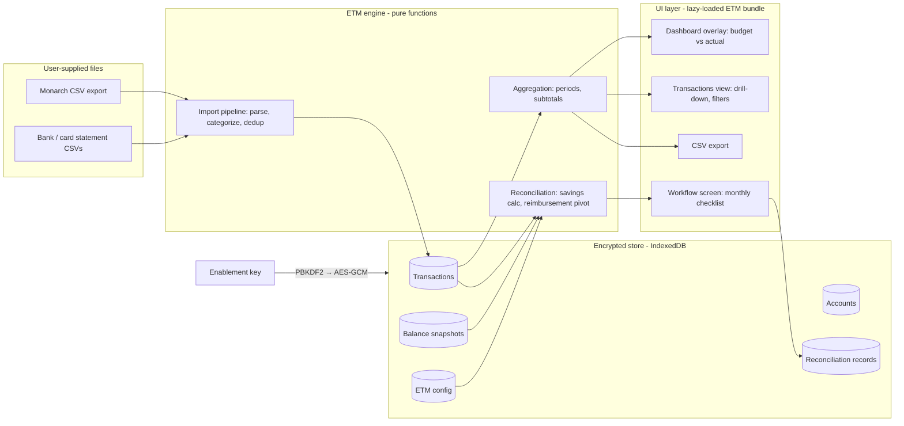

# Expense Tracking Module (ETM) — Systems Architecture & Implementation Plan

Status: **in progress** — Phase 1 (§10) is built; Phases 2–5 are still proposed.

Inputs: `docs/ExpenseTrackingModuleSpecs.md`, `docs/Workflow.md` (both private,
gitignored), `docs/product-spec.md`, `docs/category-mapping.md`, and the sample
data in `planning-data/` (gitignored).

This document is deliberately sanitized: account numbers, balances, float
amounts, tag names, and household-specific workflow details never appear in
code or committed docs. Everything personal is **user data or user
configuration**, entered at runtime and stored encrypted on the device.

## Notes for the implementing agent

- **When this document or the specs are ambiguous, stop and ask the user
  before choosing.** Do not silently pick an interpretation for anything
  touching security, the data model, dedup/identity, or the reconciliation
  math. Small UI judgment calls are yours to make.
- These decisions are already settled with the user — do not revisit them:
  the key derives real encryption (not a feature flag); Monarch is the
  transaction source of record; bank/card statement CSVs supply balances
  only, never transactions; USD is tracked natively with no conversion.
- Never commit, log, or embed anything from `planning-data/`,
  `docs/Workflow.md`, or `docs/ExpenseTrackingModuleSpecs.md` (all
  gitignored). Tests use synthetic fixtures only.
- Implement the phases in §10 in order; verify each phase's exit criteria
  before starting the next. Phase 1's "app unchanged without a key"
  criterion is load-bearing for everything after it.

---

## 1. Design principles (inherited and new)

From the Tidewater product spec, unchanged:

1. **Local-first, always.** All ETM data lives in the browser (IndexedDB).
   No server, no analytics, no cloud storage of personal data.
2. **Open-source only.** New capabilities use the browser's built-in Web
   Crypto API and the existing dependency set (React, PapaParse, idb).
   No new proprietary dependencies.
3. **Calm, non-judgmental UX.** Actual-vs-budget views inform; they never
   scold. Desktop/tablet landscape remains the target form factor.

New, from the ETM spec:

4. **Truly optional.** With the module disabled, Tidewater behaves exactly
   as it does today — same UI, same flows, and the ETM code is not even
   loaded (lazy, code-split bundle).
5. **The key is real protection, not a switch.** All ETM data is encrypted
   at rest with a key derived from the enablement key. Without the key the
   data is unreadable; a curious person with device access or a copy of the
   source code learns nothing.
6. **No bank or Monarch credentials, ever.** There is no API integration.
   All data arrives by manual CSV import or manual entry, so no credential
   can leak because none is ever held.
7. **Nothing personal in the repo.** Fixtures used for tests are synthetic.
   Real statements, workflow docs, and reconciliation sheets stay gitignored.

## 2. System overview

Three layers, mirroring the existing app's structure:

- **Engine** (`src/lib/etm/`): pure, testable functions — parsing,
  categorization, period math, aggregation, reconciliation. No DOM, no
  storage. Reuses `src/lib/categories.ts` verbatim so ETM categorization
  follows the exact philosophy documented in `docs/category-mapping.md`.
- **Store** (`src/lib/etm/storage`): a dedicated IndexedDB database,
  separate from the existing budget store, holding only AES-GCM ciphertext.
- **UI** (`src/components/etm/`): a code-split bundle mounted only after a
  successful unlock.

## 3. Module gating and key security

### Enablement flow

- A quiet entry point lives in the existing **Your data** menu:
  *"Enable expense tracking…"*. Nothing else in the app changes while the
  module is disabled — this satisfies the "operates exactly as it does now"
  acceptance criterion.
- The owner chooses the key and shares it privately with trusted users.
  There is no server, so there is no central key registry: the **first**
  entry of the key on a device initializes that device's encrypted ETM
  store; later sessions must present the same key to unlock it. Each
  device's ETM data is whatever was imported on that device (local-first).
- **Disable** locks the module (discards the in-memory key). A separate,
  clearly-worded action wipes the encrypted store entirely.

### Cryptography (Web Crypto API — built into the browser, no dependency)

| Concern | Choice |
| --- | --- |
| Key derivation | PBKDF2-SHA-256, ≥ 600 000 iterations, per-device random salt |
| Data encryption | AES-GCM 256, random 96-bit IV per record |
| Key verification | A fixed sentinel encrypted at setup; unlock succeeds only if it decrypts |
| Key at rest | Not stored by default (session unlock). Optional per-device "stay unlocked" stores the derived key as a **non-extractable** CryptoKey in IndexedDB |
| Key loss | Data is unrecoverable by design — and acceptably so, because everything is reproducible from Monarch re-exports |

What plaintext ever exists: only in page memory while unlocked. IndexedDB
holds ciphertext, the salt, and the sentinel. Exports/backups of ETM data
are written as ciphertext too (§8).

### Bundle isolation

The ETM UI and engine are loaded with a dynamic import triggered only after
unlock. Users without the key download and execute the same app they do
today, keeping the "no change for other users" promise literal.

## 4. Data architecture

A new IndexedDB database (`tidewater-etm`), independent of the existing
`tidewater.budget` key, so the budget feature can never be destabilized by
ETM migrations. Records are encrypted per month-chunk (transactions) or per
record (everything else), keeping writes small at this data scale
(a few thousand transactions per year).

### Entities

**Account** — a registry the user builds, since account meaning is personal:

| Field | Notes |
| --- | --- |
| id, nickname | e.g. "Everyday spending" — user's words |
| kind | chequing / savings / credit card |
| currency | CAD or USD; **no conversion is ever applied** (§7) |
| lastFour | display only; full numbers are never entered or stored |
| monarchName | the account string as it appears in Monarch exports, for matching |
| role flags | *funding account* (pays for everything), *savings destination*, *excluded from family budget* (e.g. a personal card tracked only for reimbursement) |
| float | optional minimum balance kept in the account (used by the savings formula) |

**Transaction** — one row per Monarch export line or manual entry:

| Field | Notes |
| --- | --- |
| id | stable content hash of (date, account, amount, original statement) plus an occurrence index, so identical rows in one file stay distinct |
| date, merchant, originalStatement, notes | from Monarch |
| amount, currency | signed; negative = spend. Currency comes from the account |
| category | the Monarch subcategory name, kept verbatim (Tidewater never renames) |
| groupId | derived via `groupForCategory` — the existing ten-group mapping |
| internal | true for transfers / card payments / balance adjustments, per the existing skip-list; internal rows are excluded from income & spend totals but remain visible in account and reconciliation views |
| tags, owner, reviewed | from Monarch; tags drive the reimbursement pivot |
| source | monarch / manual (manual covers cash spending) |
| importBatchId | for undo and provenance |

**BalanceSnapshot** — accountId, date, balance, pending charges, source
(manual entry or parsed from a bank statement CSV). These are the
reconciliation anchors.

**ImportBatch** — date range, row counts, duplicates skipped, imported-at.
Lets the user review and undo an import.

**ReconciliationRecord** — one per month: the inputs used (balances,
pending amounts), the computed savings figure, the reimbursement pivot
snapshot, transfers the user recorded, the residual delta, status
(open / reconciled), and notes.

**EtmConfig** — the user's workflow, expressed as configuration rather than
code: which tag marks a transaction reimbursable, the list of reimbursement
buckets (tag → bucket → who owes), which account is the funding account,
the float amount, the savings destination, and the reconciliation tolerance
(default: a few dollars).

### Import pipeline and dedup

Monarch is the **source of record** for transactions, categories, tags, and
splits (splits arrive from Monarch as separate rows, so no split feature is
needed in ETM).

1. Parse with PapaParse (already a dependency); validate the header shape.
2. Match each row's account string to the registry; offer to create
   unrecognized accounts during import review.
3. Compute the stable id. Existing ids are **upserted** — a re-export after
   the user re-categorized or re-tagged in Monarch updates those fields
   here, which matches the daily-review workflow. Manual transactions are
   never touched by imports.
4. Derive groupId and the internal flag using the existing rules.
5. Show an import review (mirroring the current `ImportProgress` pattern):
   new rows, updated rows, skipped duplicates, unmatched accounts.

Bank/card statement CSVs (headerless: date, description, debit, credit,
running balance; bank dates ISO, card dates MM/DD/YYYY) are parsed **only**
to capture balance snapshots — the closing running balance per account —
not as a second transaction source. This avoids a fragile matching/dedup
layer while giving reconciliation its balance anchors. Balances can always
be typed in manually instead (pending card charges must be, since no export
contains them).

## 5. Aggregation and views

A single **period selector** (month / year-to-date / custom range) drives
every ETM view. All aggregation is pure: `(transactions, period, filters) →
totals`, computed in memory (thousands of rows — no indexing infrastructure
needed).

### Dashboard integration (budget vs actual)

The existing dashboard remains the core view. With ETM unlocked it gains a
calm overlay: each group bar shows planned vs actual for the selected
period ("planned X, spent Y"), and the summary ring reflects actual income
vs actual spend. Tone stays observational — abundance, not alarm.

### Drill-down

Group → subcategory → transactions, extending the existing `GroupDetail`
pattern:

- Tapping a group shows its subcategories with budget, actual, and the
  difference, each with a subtotal.
- Tapping a subcategory reveals the underlying transactions for the period,
  with a running subtotal — the "view the underlying transactions with
  subtotals" acceptance criterion.

### Transactions view

A full filterable table: period, account, group, category, tags, owner,
amount range, and text search across merchant/statement/notes. Totals and
subtotals follow the active filters. USD accounts display in USD, visually
separated, never mixed into CAD totals.

## 6. Workflow screen (reconciliation assistant)

A new screen presenting the monthly cycle as a gentle checklist. Every
number it produces is explained on screen, because the goal is assisting a
human workflow, not replacing judgment.

1. **Import** — load the latest Monarch export (and statement CSVs or
   manual balance entries).
2. **Tidy** — surface uncategorized transactions, untagged candidates for
   the reimbursable tag, and a place to add cash transactions manually.
3. **Monthly savings** — computes: funding-account balance − float − main
   card balance − main card pending charges. Balances come from the latest
   snapshots; the result comes with a plain-language suggestion (transfer
   surplus to the savings destination, or top up a shortfall) that the user
   confirms and records — ETM never moves money.
4. **Reimbursements** — the pivot the user currently builds by hand in a
   spreadsheet: all transactions carrying the reimbursable tag, grouped by
   configured bucket, subtotaled, and expressed as "transfer N from
   account A to the funding account". Recorded transfers are noted on the
   reconciliation record.
5. **Reconcile** — compares the month's net transaction flow against the
   change in balance snapshots. Within tolerance → mark the month
   **reconciled** and store the snapshot. Outside tolerance → show the
   residual and the largest unexplained items to chase.

A year view lists the twelve months with reconciliation status, supporting
the year-end goal (all months closed before January) and leaving room for
annual events (e.g. start-of-year capital funding) as simple checklist
items defined in config.

## 7. Currency

USD accounts and cards are tracked natively in USD. No conversion, no
exchange-rate configuration. Totals, subtotals, and reconciliation are
always per-currency; mixed-currency selections show one figure per
currency. (Monarch amounts are used exactly as exported.)

## 8. Reporting and backup

- **CSV export** of transactions for any period (month / YTD / range),
  honoring the active filters, including every stored field — satisfying
  both reporting criteria. Uses the existing client-side download helper.
- **Full backup integration**: the existing JSON backup gains an optional
  ETM section containing the *ciphertext* plus salt, so a backup file on
  disk is as protected as the browser store. Restoring requires the same
  key.
- **Reconciliation summary export** (per-month figures and pivot) as a
  follow-on once the workflow screen has settled.

## 9. What this deliberately does not do

- No Monarch or TD Canada Trust API/scraping integration — credentials must
  never be held, so files and manual entry are the only inputs.
- No transaction-level import from bank statements (balances only).
- No currency conversion.
- No smartphone layout (unchanged from the product spec: future).
- No server-side anything.

### 9.1 Future direction: direct bank aggregation (e.g. Plaid)

The owner may later replace Monarch with a direct aggregator feed. That is
**out of scope** here, but the design keeps the seams it would need — do
not close them during implementation:

- **The import pipeline is the swap point.** Keep the Monarch parser fully
  isolated from dedup, group derivation, storage, and views, so a second
  feed can produce the same `Transaction` rows without touching anything
  downstream.
- **Reserve an optional `externalId` on Transaction.** Aggregators supply
  stable transaction ids and pending→posted transitions; a reserved field
  lets a future feed dedup cleanly against historical CSV-imported rows.
- **`BalanceSnapshot.source` stays open-ended** (manual / statement CSV /
  future feed).
- Known consequences to decide *then*, not now: an aggregator requires a
  small trusted backend for its secrets (a conscious relaxation of the
  no-server principle — transaction data can still live only on-device),
  and Tidewater would need to absorb the curation features currently done
  in Monarch (re-categorize, tag, split, per-merchant rules) plus a
  keyword mapping for the aggregator's category taxonomy.

---

## 10. Implementation plan

Five phases, each independently shippable and gated by the existing checks
(`npm run typecheck` plus a new `check:etm` script). Real personal data is
never used in tests; the existing synthetic `monarch-fixture.csv` is
extended with tags, owners, and multiple accounts to become the ETM
fixture.

### Phase 1 — Module shell and security foundation

- Key entry point in **Your data**; setup and unlock flows.
- Crypto layer (PBKDF2 → AES-GCM), sentinel verification, session vs
  remembered unlock, lock and wipe actions.
- Encrypted IndexedDB store scaffolding; lazy-loaded ETM bundle shell.
- **Exit criteria:** without a key the app is byte-for-byte the current
  experience; with the key, an empty ETM area unlocks; wrong key fails
  cleanly; wipe works. *(Covers the "optional module" acceptance block.)*

### Phase 2 — Import and the transaction store

- Account registry UI and Monarch-name matching.
- Monarch CSV parser, stable-id dedup, upsert-on-reimport, import review,
  batch undo. Manual (cash) transaction entry.
- Group derivation and internal-movement flagging via the existing
  `categories.ts` rules.
- **Exit criteria:** importing the fixture twice yields no duplicates;
  re-importing after category/tag edits updates rows; `check:etm` verifies
  counts and group mapping. *(Covers "transaction categorization".)*

### Phase 3 — Views: budget vs actual and drill-down

- Global period selector (month / YTD / range).
- Dashboard overlay (group bars, summary ring) with actuals.
- Group → subcategory → transaction drill-down with subtotals.
- Transactions view with full filtering; per-currency totals.
- **Exit criteria:** the two "transaction view" criteria and the "monthly
  income and expense spend" criterion demonstrably pass against the
  fixture.

### Phase 4 — Workflow screen and reconciliation

- EtmConfig UI (funding account, float, tag buckets, tolerance).
- Balance snapshots: manual entry and statement-CSV parsing.
- Savings calculator, reimbursement pivot, reconcile step, monthly
  records, year view.
- **Exit criteria:** with fixture balances, the computed savings figure
  and pivot match hand calculations; a month can be closed within
  tolerance; the residual view lists unexplained items. *(Covers the
  "workflow" criteria.)*

### Phase 5 — Reporting, backup, polish

- Filtered CSV export by month / YTD / range with all database fields.
- Encrypted ETM section in the full JSON backup and restore path.
- README and changelog updates, version bump, final UX pass for tone.
- **Exit criteria:** the two "reporting" criteria pass; a backup restored
  onto a fresh browser profile with the key reproduces the ETM state.

### Sequencing notes and risks

| Risk / open item | Handling |
| --- | --- |
| Pending card charges exist in no export | Manual entry field in the savings step; clearly labelled |
| Monarch changes its export columns | Header validation with a helpful error; parser kept isolated in the engine |
| Key forgotten | Wipe and re-import from Monarch exports; stated plainly in the unlock UI |
| Accounts not present in Monarch (e.g. others' accounts) | Reimbursements are computed purely from tags, so untracked accounts need no data |
| Scope creep into bank-statement transaction import | Explicitly out of scope (§9); balances only |
