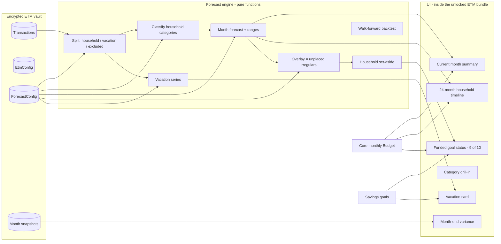

# Forecasting Module (FM) — Systems Architecture & Implementation Plan

Status: **in progress** — Phases 1–5 (§16) are built. `npm run typecheck`
and `npm run check:forecast` both pass.

Inputs: the private spec `Forecasting Module Spec.md` (iCloud
`Tidewater/Specifications/`, gitignored if copied into `docs/`),
`docs/product-spec.md`, `docs/etm-architecture.md`, `docs/category-mapping.md`,
and a 24-month Monarch export used only for methodology (never committed).

This document is deliberately sanitized. Household totals, merchant names, tag
names that identify people, account numbers, and the real export never appear
in code or committed docs. Tests use synthetic fixtures only.

## Notes for the implementing agent

- **When this document or the spec is ambiguous, stop and ask the user
  before choosing.** Do not silently pick an interpretation for anything
  touching the reimbursable allow-list, what “±5%” means, or the split
  between household and vacation series. Small UI judgment calls are
  yours to make.
- These decisions are already settled — do not revisit them:
  the module is **ETM-gated** (same unlock key, no second passphrase); it
  **reads ETM transactions**, it does not import a second copy; USD is
  tracked natively with **no conversion**; lookback uses **trailing full
  months** only; the window that produced a number is **always visible**;
  personal exports stay gitignored.
  Settled with the user, 19 Aug 2026:
  - **Vacation is its own series.** Vacation-tagged spend stays out of the
    household forecast and the core monthly budget. It is still forecast,
    separately, because travel is paid from the vacation savings pot.
    In a month with vacation spend, that month’s vacation *contribution*
    is expected to miss — the money is coming out of the pot, not going in.
  - **Known costs are placed on the month they hit.** A $2,000 repair
    known to land in December is budgeted in December. That placement
    shrinks (and can zero) the unpredictable overlay. The overlay is only
    for costs that still have no month. Do not raise the typical-month
    `Budget` as a side effect.
  - **“Nearly 100%” means about 9 months in 10.** A household savings
    goal is funded when it would have been affordable in at least 90% of
    lookback months. Do not claim certainty.
- Never commit, log, or embed anything from iCloud `Tidewater/Transactions/`,
  `planning-data/`, `docs/Workflow.md`, `docs/ExpenseTrackingModuleSpecs.md`,
  or `docs/Forecasting Module Spec.md`. If a backtest script accepts a file
  path, that path is local and the script prints aggregates only.
- Implement the phases in §16 in order; verify each phase’s exit criteria
  before starting the next. Phases 1–5 are met. Do not reopen earlier
  phases unless a later exit criterion proves them wrong.
- Tone stays observational and abundance-minded. Forecasts inform; they
  never scold. Coming in under plan is spoken of as spare room, not as a
  failure to spend.

---

## 1. Design principles (inherited and new)

From the Tidewater product spec and the ETM architecture, unchanged:

1. **Local-first, always.** All forecasting data lives in the browser
   (IndexedDB, inside the existing encrypted ETM vault). No server, no
   analytics, no cloud storage of personal data.
2. **Open-source only.** No new proprietary dependencies. Charts stay
   hand-drawn SVG.
3. **Calm, non-judgmental UX.** Desktop/tablet landscape remains the
   target form factor.
4. **Truly optional.** Without the ETM key the app is unchanged. The
   public build (`npm run build:public`) already dead-code-eliminates ETM;
   forecasting lives behind the same `__ETM_AVAILABLE__` gate so it cannot
   leak into that flavour.
5. **The key is real protection.** Forecast config, overrides, known
   futures, and monthly snapshots are sealed with the same AES-GCM key as
   the transactions they describe.

New, from the forecasting spec:

6. **History proposes, the user disposes.** Classification and dollar
   forecasts are suggestions. The user can override a category’s type, a
   category’s amount, a month’s plan, and which reimbursable sub-tags count.
7. **Never a silent “right” number.** Every headline figure names the
   lookback window that produced it. 12-month, 24-month, and all-time sit
   on a control the user can toggle. When the three disagree materially,
   say so in words.
8. **Low sample is visible.** One or two occurrences are not a cycle.
   They are flagged, never auto-promoted to “Predictable Annual.”
9. **Irregular cost is a reserve until it has a month.** A car repair is
   not placed in a future month just because one happened in June last
   year — that remainder funds the overlay. Once the user knows it will
   be $2,000 in December, they **budget December** and the overlay
   shrinks by that amount. Predictable annuals are placed on the calendar
   automatically; irregulars are placed by the user.
10. **±5% is a control window, not a claim that next month’s total can be
    predicted to that precision from history alone.** See §4.
11. **Two series, never mixed.** Household and vacation are forecast
    side by side. Vacation spend does not inflate household “out,” and
    household surplus is not treated as vacation cash.

---

## 2. System overview



Three layers, mirroring ETM:

- **Engine** (`src/lib/forecast/`): pure, testable functions. No DOM, no
  storage, no crypto. Inputs are `Transaction[]`, `Budget`, `ForecastConfig`,
  and a as-of date. Reuses `isInternalCategory`, `looksLikeIncome`,
  `groupForCategory`, and ETM period helpers. Dates stay ISO strings.
- **Store**: no new IndexedDB database. Forecast records go in the existing
  sealed `config` store under distinct ids (`forecast`,
  `forecast-snap-YYYY-MM`). Same key, same wipe.
- **UI** (`src/components/etm/ForecastPanel.tsx` and small children): a new
  **Forecast** tab beside Budget / Reimbursable / Transactions. Loaded only
  after ETM unlock, inside `OptionalFeatureBoundary`.

Forecasting is **not** a second optional module with its own key. Without
transactions there is nothing to forecast from. A quiet empty state on the
Forecast tab (“Import a Monarch export in Expenses first”) is enough.

---

## 3. Relationship to ETM and the core budget

| Concern | Choice |
| --- | --- |
| Unlock | The ETM key. No second passphrase. |
| Transactions | The rows already in the vault. No parallel import. |
| Reimbursables | Three-way split, not ETM’s all-or-nothing hold-out. **Allow-listed** sub-tags (Healthcare, Capital, Annual Fees) count as household spend that still needs cash on hand. **Vacation-tagged** spend is a separate series (§5.1). **Every other** reimbursable (personal, business, and similar) is excluded from both series. ETM budget-vs-actual is unchanged: it still holds *all* reimbursable-tagged spend out of family-budget actuals. Document the difference on the Forecast tab so the two screens do not look like they disagree. |
| Vacation | Configurable tag, default `Reimbursable: Vacation Account`. Never on the household allow-list. Forecast and budget it on its own card. Paid from the vacation savings goal / account, not from the monthly household plan. |
| Internal movements | Excluded here as in ETM (`Transfer`, `Credit Card Payment`, … via `isInternalCategory`). |
| Core `Budget` | Remains a **single typical-month plan** for household life. Forecasting does not rewrite it. Known costs are **placed on a month** (`knownFutures`). The unpredictable **overlay** is the leftover irregular mass that has not been placed yet. There is no v1 “apply to my typical month” action. |
| Public build | No new compile-time flag. `__ETM_AVAILABLE__` already drops the parent bundle. |
| Dashboard overlay | Optional later (Phase 5). First ship is the Forecast tab. Do not thread a new `DashboardForecast` type into `GroupBars` / `SummaryRing` until the engine is stable. |

Existing ETM `isReimbursable` matches the **parent** tag exactly (default
`"Reimbursable"`). The 24-month export uses both that parent tag *and*
`Reimbursable: …` sub-tags on the same rows. Forecasting must match the
**family**: a tag equal to the parent, or a tag that starts with
`parent + ":"` after whitespace-normalising. Do not change ETM’s parent-tag
match as a side effect; add family matching in the forecast engine (and a
shared helper only if ETM is updated in a later, explicit change).

---

## 4. What “±5%” means

The spec uses ±5% in two different ways. They must not be collapsed.

### 4.1 Control window (product behaviour — this is what to build)

On a month card, if `|forecast − plan| / plan > 0.05`, the month is
**outside the control window**. Tidewater lists the categories that make up
the gap and lets the user:

- add a known future expense **on that month** (the preferred fix once a cost has a date),
- raise or lower the residual overlay (only for costs that still have no month),
- override a category forecast.

After those edits, the same card must be able to read as inside ±5%. Coming
in *under* forecast is acceptable; the copy should prefer funding a little
more over running short. Placing a known December repair should be enough
on its own to bring December inside the window **and** to cut the overlay.

This is acceptance criteria 3, 4, and 5.

### 4.2 Model accuracy (what a backtest may claim)

A walk-forward test that compares a **trailing-12-month average** to the
**next calendar month’s household total** does **not** land inside ±5%.
Month totals on a lumpy household move around far more than that. A
calendar-aware placement of annuals improves the story for those
categories and still cannot predict one-off repairs.

**Do not tune the model to chase ±5% on next-month totals.** That overfits
and will still miss the next car repair.

What *is* testable, and what Fable / `check:forecast` should assert:

| Claim | How to test |
| --- | --- |
| Predictable Monthly categories | Per-category median (or last amount) vs that month’s actual; expect tight error on the synthetic fixture |
| Predictable Annual categories | The typical calendar month is recovered; amount within a tolerance on the fixture |
| Recommended set-aside vs a year | Trailing-window average vs the same window’s mean (identity) and vs the *next* 12 months (reported, not a ±5% gate) |
| Control window | Given a plan and a forecast that differ by more than 5%, **placing** the difference in that month (known future) brings the month inside the window and reduces the overlay |
| 9-of-10 surplus | On the fixture, household goal contributions are affordable in at least 90% of lookback months after `high_set_aside`; vacation months are excluded from that test for the vacation goal only |

Acceptance criterion 1 is therefore implemented as **that suite**, plus a
local backtest script the user (or Fable) can point at a private export.
The script reports hit rates honestly. It does not fail CI because a real
household’s next month missed ±5%.

---

## 5. Expense universe

Every non-internal, non-income transaction lands in exactly one of three
buckets:

| Bucket | Rule | Where it is forecast |
| --- | --- | --- |
| **Household** | Not reimbursable, **or** reimbursable with an allow-listed sub-tag | Household calendar, set-aside, ±5% window, household goals |
| **Vacation** | Has a vacation tag (default `Reimbursable: Vacation Account`) | Vacation card only. Never added into household totals. |
| **Excluded** | Any other reimbursable (personal, business, parent-tag-only, …) | Nowhere. Repaid / not a household cost. |

Assignment order:

1. Drop if `internal` / `isInternalCategory`.
2. Drop if `looksLikeIncome` (forecasting is spend; income for funded-goal
   math comes from the core `Budget`, which is the stable number).
3. If it has a **vacation** tag → vacation series. Vacation wins over the
   allow-list if both tags are present, so trip spend cannot leak into
   household groceries.
4. Else if it is in the reimbursable **family**:
   - household if any of its `Reimbursable: …` sub-tags is on the allow-list
     (case, spacing, and extra spaces after `:` ignored);
   - otherwise excluded.
5. Else if it has only the parent reimbursable tag and no sub-tag → excluded.
6. Else → household.

Amounts are the spending magnitude (`amount < 0 → −amount`); refunds net
inside the category as ETM already does.

### Default allow-list (household only)

- `Reimbursable: Healthcare Account`
- `Reimbursable: Capital Account`
- `Reimbursable: Annual Fees Account`

Vacation is **not** on this list. It has its own setting,
`vacationTags`, defaulting to `Reimbursable: Vacation Account`. Both lists
are user-editable.

The setting UI is a checklist of sub-tags that actually appear in the
vault, plus the ability to type one that has not appeared yet. Vacation
tags are chosen on the same screen, clearly labelled as the separate
series.

### 5.1 Vacation series (settled 19 Aug 2026)

Vacation travel is funded by what has already been saved, not by that
month’s household cash. Forecast it, but never fold it into household
“out,” the household ±5% window, or the overlay.

The vacation card shows:

- **Past:** vacation-tagged actuals by month (the trip months).
- **Forward:** a forecast of likely travel months and amounts, using the
  same classifiers on the vacation bucket alone (often seasonal: summer,
  holidays). Low-sample trips stay flagged, not auto-annual.
- **The pot:** the matching savings goal on the core budget (name-matched
  case-insensitively to “vacation,” or a setting `vacationGoalId`).
  `Goal.current` is the opening balance. In a **non-travel** month the
  household can contribute `goal.monthly`. In a **travel** month
  (actual or forecast vacation spend > a small threshold) that
  contribution is treated as **paused**: the month is not a miss on the
  vacation goal, because the account is being drawn down.
- **Runway:** opening balance + contributions in non-travel months −
  forecast vacation spend. If runway goes negative before a planned trip,
  say so on the vacation card, not as a household overspend.

Household funded-goal math (§11) uses household spend and **non-vacation**
goals. The vacation goal is judged only on the vacation card.

Currencies: never convert. CAD and USD forecasts are separate series. A
mixed view shows both, the way ETM does.

Lookback: **trailing N full calendar months** ending last month, relative
to an as-of date. The current (partial) month is never in the lookback.
`N` is 12, 24, or “all full months available.” If fewer months exist than
the selected window, use what exists and label the shortfall (“9 months of
history, not 12”).

---

## 6. Classification

Every **household** category is assigned one of the spec’s five types,
plus a confidence of `high` | `medium` | `low`.

For window length `N`, category `c`:

- `monthly[m]` = net household spend in month `m` (full months only)
- `present` = months where `monthly[m] > 0`
- `months_present` = `|present|`
- `mean_present`, `cv` = coefficient of variation of `present` amounts
- `calendar_months` = unique `MM` values in `present`
- `occurrences` = `months_present` (a month with several trips still
  counts once)
- `repeated_cycle` = the same `MM` appears in more than one year of the
  window (only meaningful when `N ≥ 24` or all-time)

**Low sample (overrides type):** if `occurrences < 3`, confidence is
`low`. Type is **One-Time / Irregular** (or `Emerging` in the UI copy).
**Never** auto-classify a single occurrence as Predictable Annual. Surface
it as “seen once, in {month}” and let the user pin it as annual if they
know it will return.

Otherwise:

| Condition | Type |
| --- | --- |
| `months_present / N ≥ 0.75` and `cv ≤ 0.20` | Predictable Monthly |
| `months_present / N ≥ 0.75` and `cv > 0.20` | Variable Monthly |
| `occurrences ≥ 2` and `calendar_months.size ≤ 2` and (`repeated_cycle` or `occurrences ≥ 2` with a tight month cluster) | Predictable Annual |
| `occurrences ≥ 2` and presence ≤ 0.60 and `calendar_months.size ≤ 6` | Semi-Annual / Seasonal |
| else | One-Time / Irregular |

The 0.75 presence threshold is looser than the spec’s sketch of “≥10 of
12” on purpose: a well-established monthly cost that is missing one or two
months (or that lost months because reimbursable rows were held out)
should still read as monthly. The user can override.

**Typical months:** the `MM` values in `present`, shown as words (“usually
March”), not only a smoothed dollar figure.

**Category drift:** if the last 6 full months classify differently from
the last 12, or the 12-month average is more than ~15% above the 24-month
average, flag “this category has been running higher / more often lately.”
Re-run classification whenever the window or the transactions change; do
not persist type unless the user overrode it.

User override: `ForecastConfig.categoryOverrides[key] = { type?, amount?,
typicalMonths?, ignoreOutliers? }`. A type override sticks across
reclassification. Clearing the override returns to automatic.

---

## 7. Forecast engine

All of this is `(transactions, budget, config, asOf) → ForecastResult`.
No I/O.

### 7.1 Per-category forecast

**Predictable Monthly.** Likely = median of the last 6 full months in the
window (or of all present months if fewer). High = 75th percentile of
monthly totals; low = 25th. If `cv` is very small, last amount may replace
median (captures a recent step-up without an inflation rate).

**Variable Monthly.** Same shape, but the range is the point: likely =
median of the window; high = P75; low = P25. Do not pretend the amount is
stable.

**Predictable Annual.** Place `mean_present` (or last occurrence, if the
user prefers “last paid”) in each typical `MM`. Other months get 0. The
monthly set-aside share is `typical_amount / 12` (or `/ 6` if two typical
months — still spread evenly, while the calendar view stays lumpy).

**Semi-Annual / Seasonal.** For a future month `M`, if `MM(M)` is a
typical month, use the average of that calendar month in the window when
it exists, otherwise `mean_present`. Other months 0. Set-aside share =
window total / `N`.

**One-Time / Irregular.** **Not placed on the calendar** by default. They
feed the **overlay** only: `unplaced_irregular / N` (§7.3). An outlier
toggle recomputes the window total without the largest 1 (or 2) months —
see §8. Placing a known future in a specific month removes that amount
from the overlay.

### 7.2 Month forecast (calendar)

For each month in the previous 12 full months and the next 12 calendar
months:

```
calendar[M] = Σ monthly-type likely
            + Σ annual/seasonal placed in MM(M)
            + Σ known futures dated in M
```

Irregulars are **excluded** from `calendar[M]` unless the user has placed
them as a known future in `M`. The timeline’s “forecast” bar is this
calendar figure. A second, quieter series (or a note) shows the
**overlay** — the unplaced irregular remainder, spread evenly — so a flat
month is not mistaken for a cheap month.

Past months also show **actual** household spend (same universe rule).
Vacation actuals never appear on this household strip; they live on the
vacation card.
### 7.3 Recommended monthly set-aside and the shrinking overlay

The typical-month need is the recurring shape. The **overlay** is only
what is still unpredictable.

```
placed_irregular_next_year = Σ known futures in the next 12 months
                             whose category is classified irregular
                             (or that the user tagged as drawing from the overlay)

unplaced_irregular = max(0, irregular_window_total − placed_irregular_next_year)

monthly_overlay    = unplaced_irregular / N     // 0 when everything is placed

likely_set_aside   = Σ monthly likely
                   + Σ (annual and seasonal window totals / N)
                   + monthly_overlay
                   + config.buffer              // percent or flat, visible

high_set_aside     = 90th percentile of household monthly spend in the window
                     (the 9-of-10 bar; see §11)
low_set_aside      = same as likely, with monthly P25 and overlay excluding outliers
```

Worked intent: trailing-12 irregular repairs of $4,471 and a $2,000
December placement → overlay is `($4,471 − $2,000) / 12`. Place $4,471
across months and the overlay is $0. The overlay exists so unknown
repairs still have a home; it is not a second tax on costs you have
already dated.

Headline the **likely** number, always with the window label. Show the
overlay as its own line (“still unplaced”) so the user can see it shrink.

Buffer: a visible setting, default **off** (0%). Two modes, as the spec
asked: `flat` (already in the average) or `percent` (multiply remaining
lumpy + overlay shares by `1 + p`). Do not silently add 10%.
### 7.4 Current month remainder

As-of inside month `M`:

- `actual_to_date` = household spend in `M` so far
- For each Predictable/Variable Monthly category:
  `remain = max(0, likely − actual_to_date_in_category)`
  High remain uses `high` instead of `likely`.
- For annual/seasonal whose typical `MM` is this month and that have not
  posted yet: add the expected amount.
- If they have already posted: remain 0 for that category (do not double
  count).
- Known futures in `M` still outstanding: add them.
- Irregulars: do not invent a remainder. Unplaced irregulars sit in the
  overlay; placed known futures in `M` still outstanding are added above.

`forecast_eom = actual_to_date + remain`.

Compare `forecast_eom` to this month’s **plan** (typical month + known
futures in `M`). If outside ±5%, list the categories that contribute most
to the gap. The residual overlay is shown beside the plan, not added into
December once December’s repairs have been placed.

### 7.5 Inflation (spec open question — recommended default)

Default **0%**, labelled “none.” Last-amount / 12-month vs 24-month already
captures recent levels.

Optional user-entered annual percent `r`. If on, multiply each category’s
likely/high/low by `(1 + r) ** (months_ahead / 12)` for future months
only. Past actuals are never inflated. The control is next to the window
selector; a non-zero rate is named on every headline (“including 3%
inflation”).

Also flag categories whose 12-month average is >15% above their 24-month
average as “running higher lately,” whether or not `r` is set.

Do not pull an external CPI series. There is no server.

---

## 8. Outliers, sample size, tagging quality

Carry the spec’s §7 risks into the UI:

- **Low sample:** badge on any category with `< 3` occurrences. Copy like
  “seen once — not a pattern yet.”
- **Window disagreement:** if `|set_aside_12 − set_aside_24|` is more than
  a few percent of the 12-month figure, show both numbers and a sentence
  that the window choice moves the recommendation.
- **Outlier toggle:** “with / without the largest irregular items.”
  Default **with** (honest about what happened). “Without” is for
  sensitivity, not for pretending the cost never occurs. Name the excluded
  items.
- **Untagged / ambiguous prompt:** a companion strip: household rows with
  no reimbursable family tag that sit in Uncategorized, or reimbursable
  rows with only the parent tag (no sub-tag). Link to ETM’s tidy step
  rather than duplicating it.
- **Drift:** see §6.

---

## 9. Data model

No `Budget.version` bump unless the user later asks for overlays to live
in the portable budget JSON. First ship keeps forecasting state next to
the transactions it describes.

```ts
type ForecastWindow = 12 | 24 | 'all'
type ExpenseType =
  | 'predictable-monthly'
  | 'variable-monthly'
  | 'predictable-annual'
  | 'seasonal'
  | 'irregular'

type LumpyMethod = 'average' | 'percent-buffer'

interface ForecastConfig {
  version: 1
  window: ForecastWindow
  reimbursableAllowList: string[] // default: Healthcare, Capital, Annual Fees
  vacationTags: string[] // default: ['Reimbursable: Vacation Account']
  vacationGoalId?: string // else name-match a goal containing "vacation"
  lumpyMethod: LumpyMethod
  bufferPercent: number // 0 unless lumpyMethod is percent-buffer
  inflationPercent: number // 0 unless the user turns it on
  excludeTopOutliers: number // 0, 1, or 2
  coverageTarget: number // default 0.9 — 9 months in 10
  categoryOverrides: Record<string, CategoryOverride>
  knownFutures: KnownFuture[] // the way a month gets a dated cost
}

interface CategoryOverride {
  type?: ExpenseType
  amount?: number // replaces likely for this category
  typicalMonths?: number[] // 1–12
}

interface KnownFuture {
  id: string
  category: string
  amount: number
  month: string // YYYY-MM
  recurrence: 'once' | 'annual'
  series: 'household' | 'vacation' // default household
  notes: string
}

interface ForecastSnapshot {
  month: string
  asOf: string
  window: ForecastWindow
  calendar: number // household
  overlay: number
  setAsideLikely: number
  setAsideHigh: number
  plan: number
  actual?: number
  vacationForecast?: number
  vacationActual?: number
  byCategory: Array<{ key: string; forecast: number; actual?: number }>
}
```

Persistence (existing vault, no schema version bump):

- `config` / id `forecast` → `ForecastConfig`
- `config` / id `forecast-snap-${month}` → `ForecastSnapshot`

Wipe of the ETM vault already destroys these. Disable/lock forgets the
in-memory key the same as today.

Pairing to the core budget uses the same rule ETM already uses for plan
vs actual: category / expense-line names, ignoring case and spacing.
Unpaired forecast categories still appear. Unpaired budget lines appear as
plan with a zero history forecast (acceptance criterion 2 — new category).

---

## 10. UI / UX

New tab **Forecast** in `EtmArea`, first after **Budget** (forecasting is
about the plan). Period selector on this tab is replaced by the module’s
own as-of (today) plus the window toggle.

### Current month summary card

- Plan (typical month + this month’s known futures)
- Residual overlay for costs not yet placed (household only)
- Actual to today (household rule)
- Forecast to month-end (§7.4)
- Control-window badge: inside / outside ±5%
- Variance list when outside, each row offering “place this in {month}”
- Quiet note of the recommended set-aside and whether this month is lumpy
  relative to it

### Calendar / timeline

A 24-column strip: previous 12 full months + next 12.

Each past column: actual bar, forecast bar (recomputed from data *before*
that month when a snapshot exists; otherwise from current engine — snapshots
are the honest ones).

Each future column: plan vs forecast. Tint when outside ±5%. Click opens
that month as a summary card. After the user **places** a known cost,
returning to the strip must show the month inside the window if they
brought it in, and the overlay line must have dropped.

Do not require a charting library. SVG, same family as `GoalChart`.

### Vacation card

A distinct block, not a household bar of another colour. Past trip months,
forward forecast, pot balance, runway, and a plain sentence when this
month is a travel month: the vacation contribution is paused because
spending is coming from the vacation account. Household goals are
unaffected.

### Settings row (the spec’s missing §6)

On the Forecast tab, not buried:

- Window: 12 / 24 / all-time, with the short-window warning when it applies
- Reimbursable allow-list (household)
- Vacation tags (separate series)
- Lumpy method + buffer
- Inflation
- Outlier toggle
- Coverage target (default 90%)

### Category drill-in

Type, confidence, typical months, 12 vs 24 averages, override controls,
“pin as known future.”

### Funded goal status

Uses core `Budget.income` and `Budget.goals`. See §11.

Copy stays Tidewater: “this contribution looks fundable in about 9 months
out of 10” rather than “100% certain.” That coverage statistic *is* the
acceptance criterion.

---

## 11. Funded goals and the reserve

Household goals (everything except the vacation goal) and the vacation
goal are judged separately.

```
household_committed = totalGoalContributions(budget) − vacation_goal.monthly
high_set_aside      = P90 of household monthly spend in the window
                      (enough in 9 of 10 lookback months, by construction
                      on that window; walk-forward is reported, not gated)
likely_surplus      = totalIncome(budget) − likely_set_aside
coverage            = share of lookback months where
                      totalIncome − household_spend[m] >= household_committed
```

- If `coverage ≥ 0.9` (config `coverageTarget`), household goals are
  **funded at the 9-of-10 bar**.
- If not, show the contribution that *would* have cleared 9 of 10, and
  how much the current contribution would need to ease — without scolding.
- `high_set_aside` is the spend level implied by that bar, so the user can
  see the household plan against it.

Vacation goal: never included in `coverage`. On the vacation card, a
travel month is an expected pause on `goal.monthly`, not a miss. A miss
is a non-travel month that did not contribute, or a trip that would
overdraw the pot.

The Forecast tab does not secretly rewrite goals. An explicit “use this
as my monthly contribution” button is allowed.
---

## 12. Month-end variance (acceptance criterion 5)

When the user opens Forecast after a month has closed (or from ETM’s month-end
flow, later):

1. If a `ForecastSnapshot` exists for last month, compare `actual` (now
   known) to that snapshot’s `calendar` / per-category forecasts.
2. If `|actual − calendar| / calendar > 0.05`, list categories that
   contributed most to the miss, split into “higher than forecast” and
   “lower than forecast.”
3. Offer to pin a miss as a known future, override a type, or ignore an
   outlier going forward.

If no snapshot exists (first run), recompute a walk-forward forecast from
the prior window and say that it is reconstructed, not the number they
would have seen at the time. Once snapshots start being written (on first
Forecast visit each month, or when the tab loads), later months are honest.

---

## 13. New categories and known futures (acceptance criteria 2 and 3)

A category with no history: forecast 0, plan whatever the budget line or
known future says. The month is outside the control window until the user
funds it. That is the feature.

Known futures are how a month gets a dated cost. They are **not** an extra
tax on top of the overlay — they **consume** the overlay:

- once, or annual (repeats in that `MM` each year ahead)
- amount, category (free text; may create an unpaired line)
- series: household (default) or vacation
- optional note

Example: irregular repairs of $4,471 over 12 months, then the user places
$2,000 in December. December’s household plan and forecast both include
$2,000. The monthly overlay falls by `$2,000 / 12`. Place the rest of
that mass and the overlay disappears.

They are included in both the calendar forecast and the month’s plan so
that adding one can *bring the month inside ±5%*. If the user adds a
future cost that history already places as an annual, warn (double
count), do not block.
---

## 14. Backtesting and Fable

### In-repo (CI / `npm run check:forecast`)

New synthetic file `public/sample/forecast-fixture.csv`: 24 full months,
Monarch columns, invented merchants, no real names.

It must contain, at minimum:

- a smooth monthly category (same amount ± tiny noise)
- a bumpy monthly category
- an annual fee always in the same month
- a seasonal category in two months per year
- an irregular spike in one month only
- reimbursable rows: some on an allow-list sub-tag, some not
- vacation-tagged rows in two trip months (must not enter household totals)
- a parent-only reimbursable row
- a category that appears only in the last two months (emerging)
- a USD row that must not be added into CAD
- internal transfers that must not appear as spend
- an irregular category plus a known-future placement that shrinks the overlay

`scripts/check-forecast.ts` asserts classification, the three-way split
(household / vacation / excluded), calendar placement, overlay identity
(`unplaced / N`), control-window behaviour after a placement, current-month
remainder (no double count of an annual already posted), 90% coverage
math, vacation contribution paused in a trip month, and walk-forward
*per-type* errors on that fixture.

### Local-only (Fable / the owner)

`scripts/backtest-forecast.ts <path-to-csv>` reads a private Monarch
export, prints window comparison, classification counts, walk-forward
month errors, and coverage of `high_set_aside`. No file is written into
the repo. Never default this path to the iCloud export in committed code.

---

## 15. What this deliberately does not do

- No second vault, key, or IndexedDB database.
- No Monarch API, no bank API, no CPI API.
- No currency conversion.
- No smartphone layout.
- No automatic rewrite of the core budget or of goals.
- No folding vacation-tagged spend into household totals.
- No treating a travel month as a miss on the vacation savings goal.
- No claim that next month’s household total is knowable to ±5% from
  history, or that a goal is 100% certain.
- No transaction-level import of its own.
- No placing irregular repairs onto a future calendar month without the
  user pinning them — and no leaving the overlay unchanged after they do.
- Do not finish ETM Phase 5 as a side quest; forecasting may *read*
  transactions and config, and may write only `ForecastConfig` /
  snapshots.

---

## 16. Implementation plan

Each phase is independently shippable. Gate with `npm run typecheck` and,
from Phase 1 on, `npm run check:forecast`. Personal data is never used in
those checks.

### Phase 1 — Engine and fixture (implemented)

- `src/lib/forecast/types.ts`, `universe.ts`, `classify.ts`,
  `forecast.ts`, `backtest.ts`
- `public/sample/forecast-fixture.csv`
- `scripts/check-forecast.ts` and `npm run check:forecast`
- **Exit criteria:** fixture classifications and totals match hand
  calculations in the script; internal and non-allow-listed reimbursables
  are out; allow-listed reimbursables are in household; vacation-tagged
  rows are in the vacation series only; a known-future placement shrinks
  the overlay by `amount / N`; USD is not folded into CAD; a 1-occurrence
  category is `irregular` + `low`, not annual; household goal coverage
  uses a 90% bar and ignores the vacation goal.
  *(Met: `check:forecast` and `typecheck` pass.)*

### Phase 2 — Persistence and Forecast tab shell (implemented)

- `ForecastConfig` load/save on the existing `config` store
- Forecast tab with window selector, household allow-list, vacation-tag
  picker, empty-state copy
- Defaults applied via `withForecastDefaults`
- **Exit criteria:** unlock ETM, open Forecast, change the window, reload,
  the choice is still there; lock + wrong key cannot read it; wipe removes
  it; `build:public` still has no forecast strings.
  *(Met in engine checks: config round-trips through AES-GCM; public-build
  grep asserts the main bundle has no `lib/forecast` / `ForecastPanel`
  strings. Persistence-across-reload is the browser path.)*

### Phase 3 — Current month card and timeline (implemented)

- Engine wired to live transactions + budget
- Current month summary, 24-month household SVG timeline, vacation card
- Category drill-in with typical months and confidence badges
- UI: `ForecastMonthCard`, `ForecastTimeline`, `ForecastVacationCard`,
  `ForecastCategories`
- **Exit criteria:** against the fixture imported into ETM, the timeline
  shows the annual in the expected month and the irregular *not* projected
  forward; vacation actuals do not change household bars; current-month
  remainder does not double-count a posted annual.

### Phase 4 — Control window, known futures, shrinking overlay (implemented)

The handoff below was the build brief; it is kept for history. **Met:**
`ForecastMonthCard` badge and Place/remove, `ForecastCategories` pin,
outlier toggle, 12 vs 24 disagreement sentence, tagging-gaps strip that
points at Month-end tidy. Engine math was not rewritten.

**Handoff for a fresh agent.** Phases 1–3 are done. `npm run typecheck` and
`npm run check:forecast` pass. Do not rewrite the engine math. Wire UI to
types and functions that already exist.

#### Already in the engine (do not reimplement)

| Piece | Where |
| --- | --- |
| `KnownFuture` on `ForecastConfig` | `src/lib/forecast/types.ts` |
| Overlay shrinks by `placed / N` when a known future’s category is irregular | `overlayFor` in `forecast.ts` |
| `MonthPoint.outsideControlWindow`, `gapRatio`, `variances` | types + `variancesFor` / `isOutsideControlWindow` |
| `CurrentMonthView` has the same three fields | `forecast.ts` current-month path |
| Timeline already tints future/current columns that are outside ±5% | `ForecastTimeline.tsx` |
| `excludeTopOutliers` 0 / 1 / 2 | config + `overlayFor` |
| `doubleCounts` when a known future collides with an annual already placed | `ForecastResult.doubleCounts` |
| Fixture test: December starts outside ±5%; placing a repair brings it inside | `scripts/check-forecast.ts` |
| Encrypted save | `saveForecastConfig` via `data.saveForecastSettings` |

#### Build (UI + small helpers)

1. **±5% badge** on `ForecastMonthCard` from `point.outsideControlWindow` /
   `current.outsideControlWindow`. Calm copy, not alarm: inside / outside
   the control window. Coming in under plan is spare room.
2. **Variance list** when outside: render `point.variances` (or
   `current.variances` on the current month). Each row: category, delta,
   a **Place in {month}** action.
3. **Place in {month}** appends a `KnownFuture` (`uid('future')` from
   `src/lib/format.ts`) to `config.knownFutures` and calls
   `onConfigChange`. Default `series: 'household'`, `recurrence: 'once'`,
   `amount` = the gap for that category (or a small amount field). After
   save, the engine recomputes: overlay drops if the category is
   irregular; the month can enter the window. List existing placements
   for the focused month with a remove control.
4. **Category drill-in** (`ForecastCategories` modal): “Pin as known
   future” for the focused month (and optional annual recurrence). Warn
   (do not block) using `result.doubleCounts`.
5. **Outlier toggle** on the Forecast settings row: 0 / 1 / 2 →
   `config.excludeTopOutliers`. Name excluded items from
   `household.overlay.excludedOutliers`. Default remains **with** (0).
6. **12 vs 24 disagreement:** if the selected window is not 24, call
   `forecast(..., { ...config, window: 24 }, ...)` once more (or 12 when
   on 24) and, when `|likely_12 − likely_24|` is more than a few percent
   of the 12-month figure, show both numbers and a sentence that the
   window choice moves the recommendation. Do not add a second silent
   default.
7. **Untagged / parent-only prompt:** a companion strip, not a second
   tidy workflow. Household-uncategorized rows, and reimbursable-family
   rows that have only the parent tag. Link people to the ETM Month-end
   tidy step. A small helper in `universe.ts` is fine; keep personal
   merchants out of committed tests (use the fixture).

Vacation placements use `series: 'vacation'` if the pin happens from the
vacation card; household is the default. Do not fold vacation into the
household ±5% window.

Lumpy method + buffer + inflation controls may sit on the same settings
row if they are one-line toggles; do not expand into Phase 5 snapshots or
goal-coverage UI.

#### Files to touch (expected)

- `src/components/etm/ForecastMonthCard.tsx` — badge, variances, place/remove
- `src/components/etm/ForecastPanel.tsx` — outlier toggle, window-disagreement
  sentence, untagged strip, pass `onConfigChange` / focused month down
- `src/components/etm/ForecastCategories.tsx` — pin as known future
- `src/lib/forecast/universe.ts` — optional untagged/parent-only helper
- `scripts/check-forecast.ts` — only if you add a helper; existing placement
  arithmetic must still pass
- Tone: `forecastCopy.ts` if new sentences are needed. No emoji.

#### Do not

- Rewrite `forecast.ts` placement/overlay math unless a UI bug proves it wrong
- Mutate the core `Budget`
- Start Phase 5 (snapshots, funded-goal coverage UI, README, version bump)
- Commit private CSVs or iCloud files
- Add a charting library

#### Exit criteria

- A month outside the window can be brought inside by placing a known
  future; the overlay drops by `amount / N` for an irregular category
- `npm run check:forecast` and `npm run typecheck` still pass
- Public build still has no forecast strings (`check:forecast` already greps)

Tone stays observational. Forecasts inform; they never scold.

### Phase 5 — Funded goals, snapshots, month-end variance (implemented)

**Handoff for a fresh agent (Grok 4.6).** Phases 1–4 are done.
`npm run typecheck` and `npm run check:forecast` pass. Do not rewrite
classification, overlay, or ±5% math. Wire UI and persistence to types
that already exist.

#### Already done (do not rebuild)

| Piece | Where |
| --- | --- |
| `CoverageResult` / `coverageFor` (90% bar, vacation goal excluded) | `forecast.ts`, `result.coverage` |
| Vacation pot, runway, contribution paused in travel months | `ForecastVacationCard.tsx` |
| `ForecastSnapshot` type | `src/lib/forecast/types.ts` |
| Encrypted `config` store, id `forecast` | `loadForecastConfig` / `saveForecastConfig` |

#### Build

1. **Household funded-goal card** on the Forecast tab. Use
   `result.coverage`. Copy: “this contribution looks fundable in about 9
   months out of 10” when `funded`; otherwise show `monthsHit` of
   `monthsConsidered` and `contributionThatWouldClear`. Never say
   “certain.” Vacation stays on its own card (already built).
2. **Optional explicit action** “use this as my monthly contribution”
   for **household** goals only. It must write `Budget.goals` through the
   existing App `commit` path (thread a callback from `EtmArea` /
   `EtmModule` if needed). Do not secretly rewrite goals on view.
3. **Snapshots.** Persist `ForecastSnapshot` as sealed records in the
   existing `config` store: id `forecast-snap-${YYYY-MM}`. Add
   `loadForecastSnapshot` / `saveForecastSnapshot` in
   `src/lib/etm/storage/repo.ts`. No IndexedDB version bump. Write (or
   refresh) the current month’s snapshot when the Forecast tab is shown
   with transactions loaded. Wipe of the ETM vault already destroys them.
4. **Month-end variance.** For last full month: if a snapshot exists,
   compare household actual to that snapshot and list category misses
   when outside ±5%. If none exists, recompute a walk-forward from the
   prior window (`src/lib/forecast/backtest.ts` if it already does this)
   and **label it reconstructed**, not the number they would have seen
   at the time. Offer to pin a miss as a known future (reuse Phase 4
   place/remove).
5. **Docs / version.** MINOR bump `0.3.4` → `0.4.0` in **both**
   `package.json` and `src/lib/version.ts`. `CHANGELOG.md` entry.
   README: a short Forecasting paragraph under the ETM / expenses
   material. `GEMINI.md`: one factual line that the Forecast tab exists
   inside unlocked ETM. Do not invent ETM backup/export (ETM Phase 5).

#### Files to touch (expected)

- `src/components/etm/ForecastGoals.tsx` (new) + `ForecastPanel.tsx`
- `src/lib/etm/storage/repo.ts` + `useEtmData.ts`
- `src/components/etm/EtmArea.tsx` / `EtmModule.tsx` / `App.tsx` only if
  the contribution action needs `commit`
- `scripts/check-forecast.ts` — snapshot round-trip through AES-GCM if
  cheap; coverage assertions already exist
- `package.json`, `src/lib/version.ts`, `CHANGELOG.md`, `README.md`,
  `GEMINI.md`

#### Do not

- Use Fable for this phase
- Mutate goals except via the explicit button
- Fold vacation into household coverage
- Start ETM Phase 5 (JSON backup of the vault)
- Commit private CSVs
- Add a charting library

#### Exit criteria

- Acceptance criteria 4–6 demonstrable on the fixture (control window
  already Phase 4; funded 9-of-10; travel month is not a vacation-goal
  miss — vacation card already asserts the pause)
- Stored snapshot vs reconstructed labelled correctly
- `npm run typecheck` and `npm run check:forecast` pass
- `APP_VERSION` matches `package.json` (`0.4.0`)
  *(Met: snapshot AES-GCM round-trip and stored-vs-reconstructed labels in
  `check:forecast`; coverage 9-of-10 and vacation pause already asserted.)*

### Sequencing notes and risks

| Risk / open item | Handling |
| --- | --- |
| Next-month total ±5% is not a realistic model claim | §4; do not chase it |
| Reimbursable sub-tag vs parent tag | Family match in FM only; three-way split in §5 |
| Vacation-tagged spend | Own series; never household; contribution paused in trip months |
| Core budget is one typical month | Known futures on the month they hit; overlay = unplaced remainder |
| 9-of-10 funding | P90 / 90% coverage on household goals; vacation judged separately |
| Short or missing history | Label the shortfall; empty state until import |
| Category names drift (`Internet` vs `Internet and Phone`) | Same pairing as ETM; user can override |
| Inflating twice (last-amount and `r`) | Default `r = 0`; last-amount only when cv is tiny |
| ETM Phase 5 (backup/export) unfinished | FM data is in the vault; when Phase 5 lands, ciphertext backup will include these config ids automatically if it already dumps the `config` store — verify then, do not block FM on it |

---

## 17. Open questions

The three questions from the first draft are **settled** (19 Aug 2026) —
see the notes at the top. Do not reopen them.

Stop and ask only if a new ambiguity appears (for example: two goals both
named in a way that could match “vacation,” or a transaction tagged both
vacation and an allow-listed healthcare sub-tag — this document already
says vacation wins).

Settled: ETM-gated; no second key; irregulars off the calendar until
placed; placements shrink the overlay; vacation is a separate series;
coverage target 90%; inflation default 0%; ±5% is the control window;
CAD/USD never mixed; snapshots for honest month-end variance.
